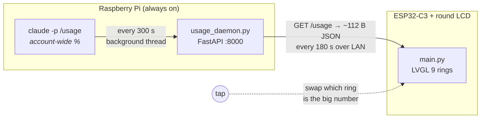

# Claude Usage Dial

A 1.28" round LCD on the desk that shows how much of your Claude subscription
you have burned through — the **5-hour session** and the **weekly** budget, as
two rings, updated over Wi-Fi.

<!-- Add photos here, e.g.:
<p align="center">
  
  
</p>
-->

**Why two devices?** The usage numbers only exist inside the Claude Code CLI,
which needs a logged-in machine — an ESP32 cannot run it. So a Raspberry Pi
that is already on anyway polls the CLI and serves the two numbers as tiny
JSON on the LAN; the board just draws them.

**Why not read usage on the board directly?** There is no public usage API.
`claude -p "/usage"` is answered *inside* the CLI (no model turn, no tokens,
~300 ms) and returns the **account-wide** figures, so usage from your laptop,
phone and any other device is included.

---

## How it works



Two design points that follow from the hardware:

- **The board has no clock.** The daemon sends *seconds until reset*, not
  timestamps, and the display counts down locally between fetches.
- **Polling is decoupled from serving.** The CLI runs on its own thread and
  `/usage` only reads the cached sample, so a slow CLI run can never outlast
  the board's 5 s socket timeout and be mistaken for a dead daemon.

---

## Hardware

| Part | What exactly |
|---|---|
| Display board | **ESP32-2424S012C** — 1.28" round module, ESP32-C3 (RISC-V, single core, 4 MB flash, **no PSRAM**) |
| Panel | GC9A01, 240×240, SPI @ 40 MHz |
| Touch | CST816S, I²C `0x15` |
| Server | Raspberry Pi (any model running 64-bit Raspberry Pi OS, systemd) |
| Link | Plain HTTP over your LAN — **wire the Pi if you can** (≈2.5 ms vs. 80–140 ms over Wi-Fi) |

### Board firmware

Stock MicroPython is not enough — a 240×240×16bpp framebuffer is 115 KB and
will not allocate on a PSRAM-less C3. The board runs a **custom
LVGL-MicroPython build** (MicroPython 1.27 + LVGL 9.4 + ESP-IDF 5.5.1) with
the `gc9a01` and `cst816s` drivers frozen in. The flashable image is
committed:

- [`esp/firmware/lvgl-micropython-esp32c3-gc9a01-cst816s.bin`](esp/firmware/lvgl-micropython-esp32c3-gc9a01-cst816s.bin) — combined image, flash at offset `0x0`
- [`esp/firmware/lvgl-firmware-instructions.md`](esp/firmware/lvgl-firmware-instructions.md) — how it was built, pin map, the LVGL 9.4 API gotchas, troubleshooting

You do **not** need to rebuild it unless you use a different board or panel.

---

## Prerequisites

**On the Raspberry Pi** — runs the daemon:

| | |
|---|---|
| Claude Code CLI | installed **and logged in as the user that will run the daemon** — `claude -p "/usage"` must work over plain SSH |
| Subscription | a Claude plan whose `/usage` reports session + weekly limits (Pro/Max) |
| Python | ≥ 3.11 (`tomllib`), plus [uv](https://docs.astral.sh/uv/) |

**On whichever machine holds the USB cable** — flashes and uploads to the board:

| | |
|---|---|
| `esptool` ≥ 5 | one-time firmware flash |
| `mpremote` | uploading `main.py` / `config.py` |

> **The board half is OS-independent.** `esptool` and `mpremote` are plain
> Python packages; they install and behave identically on Raspberry Pi OS,
> Linux, macOS and Windows, and **the only thing that differs between those
> platforms is the name of the serial port**. So plug the board into a USB
> port on the Pi and do everything there over SSH, or plug it into your
> laptop and work from the clone there — either way, **no second machine and
> no vendor IDE is required.** The commands below are written once, with
> `<PORT>` standing in for the one platform-specific value.

---

## Setup

Clone this repository **on the Raspberry Pi**; everything below assumes it
sits at `~/claude-monitor`:

```bash
git clone https://github.com/schote/claude-monitor.git ~/claude-monitor
```

### 1. Raspberry Pi daemon

```bash
curl -LsSf https://astral.sh/uv/install.sh | sh
```

```bash
cd ~/claude-monitor/rpi && ~/.local/bin/uv sync
```

Verify the CLI is reachable and logged in — `--check` runs a single poll,
prints what the CLI said, and exits:

```bash
cd ~/claude-monitor/rpi && ~/.local/bin/uv run claude-usage-daemon --check
```

### 2. Enable the service

[`rpi/claude-usage.service`](rpi/claude-usage.service) is a **system** unit
that runs as *you* (the CLI's login lives in your `~/.claude/.credentials.json`).
Edit `User=` and the two absolute paths — `WorkingDirectory=/home/<you>/claude-monitor/rpi`
and the `ExecStart=` below it — then install and start it:

```bash
sudo cp ~/claude-monitor/rpi/claude-usage.service /etc/systemd/system/ && sudo systemctl daemon-reload && sudo systemctl enable --now claude-usage
```

```bash
curl -s http://localhost:8000/usage
```

Logs: `journalctl -u claude-usage -f`.

> `%h` is **not** usable in a system unit — it resolves to `/root` regardless
> of `User=`. Spell `WorkingDirectory=` and `ExecStart=` out in full.
> `WorkingDirectory` is also where `config.toml` is looked up.

### 3. ESP32 display

Run these from the repository root, on the machine the board is plugged into
— the Pi itself, or any Mac/Linux/Windows box with a clone of this repo.

**Install the tools.** One command everywhere; both are pure Python:

```bash
pip install --user "esptool>=5" mpremote
```

**Find the port.** Let `mpremote` discover it rather than guessing your
platform's naming scheme — unplug the board and re-run to confirm which entry
disappeared:

```bash
mpremote connect list
```

| Platform | Port looks like |
|---|---|
| Raspberry Pi OS / Linux | `/dev/ttyACM0` |
| macOS | `/dev/cu.usbmodem14301` (the `cu.*` device, not `tty.*`) |
| Windows | `COM4` |

Substitute yours for `<PORT>`. Two platform notes — and that is the complete
list of differences:

- **Linux / Raspberry Pi OS:** your user needs serial access. `sudo usermod -aG dialout $USER`,
  then log out and back in; otherwise every command fails with a permission error.
- **Any OS:** quit an editor extension that auto-connects (MicroPico, Thonny),
  or it holds the port and everything fails with `port is busy`.

**Flash the firmware** — once, or to recover a bricked board. The image is
combined (bootloader + partition table + app), so it goes to offset `0x0`:

```bash
esptool --chip esp32c3 -p <PORT> -b 460800 erase-flash
```

```bash
esptool --chip esp32c3 -p <PORT> -b 460800 write-flash 0x0 esp/firmware/lvgl-micropython-esp32c3-gc9a01-cst816s.bin
```

If the board will not connect, put it in bootloader mode: hold **BOOT**, tap
**RST**, release **BOOT**.

**Copy the app.** Fill in Wi-Fi and the daemon address in
[`esp/config.py`](esp/config.py) first, then upload both files and reset —
`mpremote` chains commands with `+`:

```bash
mpremote connect <PORT> fs cp esp/config.py :config.py + fs cp esp/main.py :main.py + reset
```

Watch it come up (**Ctrl-]** to exit):

```bash
mpremote connect <PORT> repl
```

> **Point `USAGE_URL` at an IP address, not a `.local` name.** MicroPython has
> no dependable mDNS, and a router serves a stale record for days after a
> machine moves between Wi-Fi and Ethernet. Give the Pi a DHCP reservation.

---

## Configuration

**Pi** — [`rpi/config.toml`](rpi/config.toml), every key optional:

| Key | Default | Meaning |
|---|---|---|
| `claude.bin` | `claude` on `PATH`, else `~/.local/bin/claude` | the CLI to poll |
| `claude.workdir` | `/tmp` | directory the CLI runs in |
| `claude.prune_sessions` | `true` | delete each poll's own ~2 KB session transcript |
| `poll.ttl_s` | `300` | seconds between CLI polls (also the retry interval on failure) |
| `poll.cli_timeout_s` | `60` | give up on a hung CLI |
| `server.host` / `port` | `::` / `8000` | dual-stack bind, see below |

**Board** — [`esp/config.py`](esp/config.py):

| Key | Default | Meaning |
|---|---|---|
| `WIFI_SSID` / `WIFI_PASSWORD` | — | required |
| `USAGE_URL` | — | `http://<pi-ip>:8000/usage` |
| `USAGE_URLS` | `()` | fallback addresses, tried after two failures |
| `FETCH_INTERVAL_S` | `180` (built-in fallback `120`) | how often to ask the daemon |
| `WATCHDOG` | `True` | set `False` while developing — it reboots out from under a REPL |

Both files are checked in with placeholder values. Copy them to your own
working copies and keep credentials out of git.

---

## API

`GET /usage` — flat, one `json.loads` on the board:

```json
{"five_hour_pct": 69, "weekly_pct": 43, "five_hour_reset_s": 9937,
 "weekly_reset_s": 425137, "age_s": 0, "polled_at": 1788105262,
 "polled_at_str": "17:54", "ts": 1788105262}
```

- `polled_at_str` is preformatted local time — the board has neither a clock
  nor a timezone database.
- `age_s` lets the board show `stale` even while the daemon answers happily.
- A reset of `-1` means the CLI's wording could not be parsed; the display
  leaves that countdown blank rather than inventing one.
- If the CLI fails, the last good sample keeps being served with a growing
  `age_s`. `503` only when there has never been a good one.

`GET /healthz` — liveness, last error, and the **raw CLI text** of the last
poll (the first place to look if a CLI update changes the wording).

---

## Reading the display

| Element | Meaning |
|---|---|
| Outer / inner ring | 5-hour and weekly usage; **tap** to swap which is the big number |
| `upd 17:54` | when the figures were actually read from Claude |
| Countdown (bottom) | time until the next request to the daemon — the liveness signal |
| 🟢 / 🟠 / 🔴 dot | last fetch succeeded / figures are stale / Wi-Fi or daemon unreachable |

Before the first successful fetch the board shows a fallback screen naming
what it is waiting on (`connecting Wi-Fi…`, `reaching daemon…`, `no daemon`,
`waiting for data…`) and the host it is pointed at, so a wrong `USAGE_URL` is
visible from across the room. Once data arrives, the rings keep the last known
values through any later failure — the dot turns red rather than the numbers
disappearing.

---

## Staying up

A display that silently stops updating is worse than one that reboots, so each
failure gets the cheapest escape that could fix it:

| After | The board |
|---|---|
| every failure | retries sooner, backing off 10 → 20 → 40 … s |
| 2 failures | drops the cached address, moves to the next in `USAGE_URLS` |
| 4, 8, 12 … failures | tears the Wi-Fi association down and rebuilds it |
| 15 min without data | reboots (`REBOOT_AFTER_S`) |
| 30 s without a UI tick | reboots, from the hardware watchdog (`WATCHDOG_S`) |

The watchdog is fed only from inside the LVGL tick callback, so if the UI
thread dies the board restarts itself. The 2 s Ctrl-C window at boot runs
before the watchdog is armed, so uploads are unaffected.

---

## Repository layout

| Path | |
|---|---|
| [`esp/main.py`](esp/main.py) | the board app — LVGL rings, Wi-Fi, HTTP/1.0 over a raw socket, recovery ladder |
| [`esp/config.py`](esp/config.py) | Wi-Fi + daemon address |
| [`esp/firmware/`](esp/firmware) | the flashable LVGL image and its full build/API reference |
| [`rpi/usage_daemon.py`](rpi/usage_daemon.py) | FastAPI daemon: polls the CLI on a thread, serves the cached sample |
| [`rpi/config.toml`](rpi/config.toml) | daemon settings (nothing is read from the environment) |
| [`rpi/claude-usage.service`](rpi/claude-usage.service) | systemd unit, with the rationale in its header |

## License

MIT — see [LICENSE](LICENSE).
